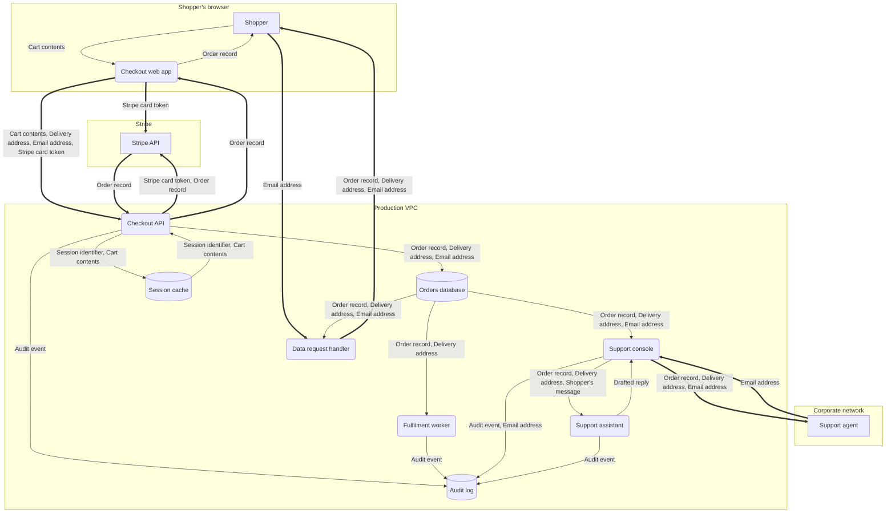

# Acme Checkout — data flow diagram

Takes an order from a shopper, charges their card through Stripe, and hands the order to fulfilment. Serves consumers in the EU and UK.

**Scoped for:** STRIDE (security), LINDDUN (privacy)

## Scope

**In scope**

- The checkout web app, its API, the fulfilment worker, the support console, and the support assistant that drafts replies inside it
- The data subject access and deletion path

**Out of scope**

- The warehouse management system, treated as a consumer of orders
- Stripe's internals, treated as a third-party service
- The marketing site, which shares no data with checkout

## Diagram

Rectangles are external entities, rounded boxes are processes, cylinders are data stores, and boxed groups are trust zones. A thick arrow crosses a trust boundary.

## Trust zones

| Zone | Controlled by | Description |
|---|---|---|
| Shopper's browser | end_user | Fully under the shopper's control; nothing running here is trusted. |
| Corporate network | us | Staff laptops and the SSO estate. Trusted for identity, not for authorisation. |
| Production VPC | us | Private subnets in our AWS account. No inbound access except through the edge proxy. |
| Stripe | third_party | Payment processor. We see tokens and outcomes, never card numbers. |

## External entities

| Actor | Type | Zone | Authenticated by | Data subject |
|---|---|---|---|---|
| Shopper | human | Shopper's browser | Email and password with optional TOTP; guest checkout is anonymous. | yes |
| Support agent | human | Corporate network | Okta SSO with mandatory WebAuthn. | no |
| Stripe API | third_party_service | Stripe | Publishable key in-browser; restricted secret key server-side. | no |

## Processes

| Process | Zone | Owner | Authn | Authz | Logging |
|---|---|---|---|---|---|
| Checkout web app | Shopper's browser | Storefront team | Session cookie issued by the API; no credentials held in the page. | None — every decision is re-made server-side. | Client errors to Sentry with PII scrubbing on; no order contents. |
| Checkout API | Production VPC | Payments team | mTLS from the edge proxy, plus the shopper's session cookie for user context. | Row-level ownership checks on every order read or write. | Structured audit events to the audit log; request logs without bodies. |
| Fulfilment worker | Production VPC | Fulfilment team | IAM role; no inbound network path. | Read-only database role scoped to paid orders. | Audit event per dispatched order. |
| Support console | Production VPC | Support engineering | Okta SSO, WebAuthn enforced, session bound to device. | Role-based; addresses are masked unless the agent opens a ticket-linked view. | Every lookup written to the audit log with the agent identity and reason. |
| Support assistant | Production VPC | Support engineering | IAM role; reachable only from the support console, no public route. | The refund tool is capped and scoped to the order in the open ticket. | Prompt, every tool call, and every refund decision to the audit log. |
| Data request handler | Production VPC | Privacy team | Okta SSO for the approver; IAM role for the job. | Two-person rule on erasure runs. | Full audit trail of every request, approval, and export. |

## Data stores

| Store | Kind | Zone | Holds | At rest | Access | Retention | Backups |
|---|---|---|---|---|---|---|---|
| Orders database | database | Production VPC | Order record, Delivery address, Email address | AES-256 via AWS KMS, customer-managed key. | Service roles only. Human access is break-glass through PAM and alerts the on-call. | Orders kept 7 years for tax; addresses purged 90 days after delivery. | Nightly snapshots retained 35 days in the same account, same KMS key. |
| Audit log | log | Production VPC | Audit event, Email address | AES-256 via AWS KMS; object lock prevents deletion before expiry. | Write-only for services. Read requires a security team role. | 2 years, then hard delete. | Cross-region replication, same 2-year expiry. |
| Session cache | cache | Production VPC | Session identifier, Cart contents | In-memory only, encrypted volume; no persistence to disk. | Checkout API service role only. | 30-minute TTL; nothing survives a restart. | — |

## Data dictionary

| Data | Classification | Personal data | Subjects | Retention | Lawful basis |
|---|---|---|---|---|---|
| Email address | confidential | personal | Shoppers | Life of account plus 30 days | Contract |
| Delivery address | confidential | personal | Shoppers and their gift recipients | 90 days after delivery | Contract |
| Cart contents | internal | pseudonymous | Shoppers | 30 minutes in cache; persisted only once an order is placed | Legitimate interests |
| Order record | confidential | personal | Shoppers | 7 years | Contract |
| Stripe card token | restricted | pseudonymous | Shoppers | Not stored; passed through and discarded | Contract |
| Session identifier | confidential | pseudonymous | Shoppers | 30 minutes | Legitimate interests |
| Shopper's message | confidential | personal | Shoppers | 2 years with the ticket | Contract |
| Drafted reply | confidential | personal | Shoppers | 2 years with the ticket | Contract |
| Audit event | confidential | personal | Shoppers and staff | 2 years | Legal obligation |

## Data flows

| Flow | From | To | Carries | Protocol | In transit | Authn | Trigger | Crosses boundary |
|---|---|---|---|---|---|---|---|---|
| Browse and build cart | Shopper | Checkout web app | Cart contents | In-page interaction | n/a — never leaves the browser | n/a — anonymous until checkout | user_action | no |
| Tokenise card | Checkout web app | Stripe API | Stripe card token | HTTPS POST to Stripe Elements | TLS 1.3 | Stripe publishable key | user_action | yes |
| Submit order | Checkout web app | Checkout API | Cart contents, Delivery address, Email address, Stripe card token | HTTPS POST /orders | TLS 1.3 | Session cookie, SameSite=Lax, plus CSRF token | user_action | yes |
| Charge card | Checkout API | Stripe API | Stripe card token, Order record | HTTPS POST to Stripe charges | TLS 1.3 | Restricted secret key, rotated quarterly | event | yes |
| Charge result | Stripe API | Checkout API | Order record | HTTPS response and webhook | TLS 1.3 | Webhook signature verification | event | yes |
| Persist order | Checkout API | Orders database | Order record, Delivery address, Email address | Postgres wire protocol | TLS, verify-full | IAM database authentication | event | no |
| Write session | Checkout API | Session cache | Session identifier, Cart contents | Redis over TLS | TLS 1.2 | Redis AUTH plus security group | event | no |
| Read session | Session cache | Checkout API | Session identifier, Cart contents | Redis over TLS | TLS 1.2 | Redis AUTH plus security group | event | no |
| Write audit event | Checkout API | Audit log | Audit event | HTTPS to the log ingest endpoint | TLS 1.3 | IAM role | event | no |
| Order confirmation | Checkout API | Checkout web app | Order record | HTTPS response | TLS 1.3 | Session cookie | event | yes |
| Show confirmation | Checkout web app | Shopper | Order record | In-page rendering | n/a — never leaves the browser | n/a — already in the shopper's session | event | no |
| Poll for paid orders | Orders database | Fulfilment worker | Order record, Delivery address | Postgres wire protocol | TLS, verify-full | IAM database authentication, read-only role | scheduled | no |
| Record dispatch | Fulfilment worker | Audit log | Audit event | HTTPS to the log ingest endpoint | TLS 1.3 | IAM role | event | no |
| Look up an order | Support agent | Support console | Email address | HTTPS | TLS 1.3 | Okta SSO session with WebAuthn | user_action | yes |
| Read order for support | Orders database | Support console | Order record, Delivery address, Email address | Postgres wire protocol | TLS, verify-full | IAM database authentication, read-only role | event | no |
| Show order to agent | Support console | Support agent | Order record, Delivery address, Email address | HTTPS | TLS 1.3 | Okta SSO session | event | yes |
| Record support lookup | Support console | Audit log | Audit event, Email address | HTTPS to the log ingest endpoint | TLS 1.3 | IAM role | event | no |
| Ask the assistant to draft a reply | Support console | Support assistant | Order record, Delivery address, Shopper's message | HTTPS POST inside the VPC | TLS 1.3 | IAM role, plus the agent identity of the console session | user_action | no |
| Return the draft | Support assistant | Support console | Drafted reply | HTTPS response inside the VPC | TLS 1.3 | IAM role | event | no |
| Record the prompt and the tool calls | Support assistant | Audit log | Audit event | HTTPS to the log ingest endpoint | TLS 1.3 | IAM role | event | no |
| Data subject access or erasure request | Shopper | Data request handler | Email address | HTTPS form, or email to the privacy inbox | TLS 1.3 | Identity verification against the account, or documentary proof for guests | user_action | yes |
| Assemble the shopper's data | Orders database | Data request handler | Order record, Delivery address, Email address | Postgres wire protocol | TLS, verify-full | IAM database authentication, approved run only | manual | no |
| Deliver the export | Data request handler | Shopper | Order record, Delivery address, Email address | Expiring signed download link over HTTPS | TLS 1.3 | One-time link tied to the verified identity, 72-hour expiry | manual | yes |

## Assumptions

- Card numbers never reach our servers; Stripe Elements tokenises in-browser.
- The corporate network is not trusted; the support console authenticates every request regardless of network position.

## Open questions

- Nobody could confirm whether the nightly database snapshots are covered by the 90-day address purge, or whether they retain addresses for 35 days past it.

## Reviewed against

This model has been read against the documents below. It is a claim about documents, never about the system: a design change made without one is invisible here. The oldest reading here is from 2026-09-10. This model asks to be read again every 365 days.

| Document | Read on | Impact | Why |
|---|---|---|---|
| skills/dfd/assets/example.spec.md | 2026-09-10 | modelled | Two sections were added about a support assistant the model did not contain. Reading them put `support-assistant` in as an agent process, with `assist-request`, `assist-draft` and `assist-audit` around it and `shopper-message` and `draft-reply` as data. The older sections still describe what was already here — how guest email is bound, how support lookups are logged — and moved nothing. |

---

_Generated from the model by `render_dfd.py`. Edit the `.dfd.yaml` and regenerate; changes made here will be lost._
